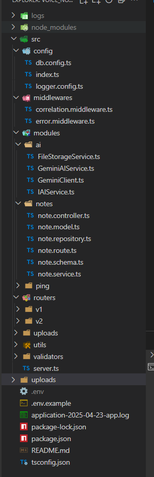
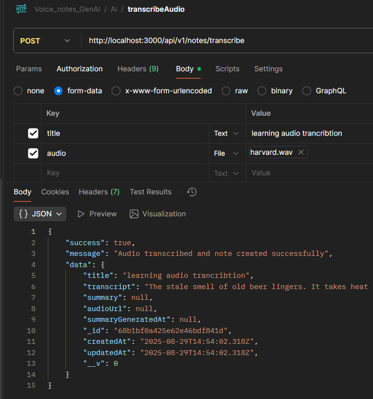
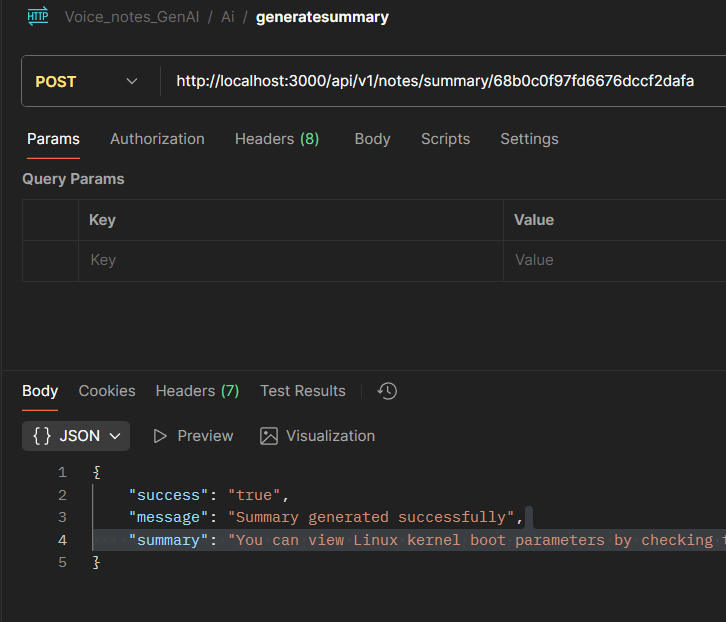

# 🎙️ Voice Notes GenAI Backend

An **AI-powered voice notes backend** built with **Node.js, TypeScript, Express, MongoDB, and Google Gemini AI**.
This backend allows users to **upload audio files, transcribe them into text, and summarize them** — making note-taking smarter and faster.

---

## ✨ Features

* 📌 **Audio Upload & Transcription** – Upload `.wav`, `.mp3`, files and get transcribed text via **Gemini AI**
* 📝 **Note Management** – Store, retrieve, update, and delete notes in MongoDB
* 📖 **AI Summarization** – Summarize long notes into short, meaningful text
* 🧩 **Clean Architecture** – Separation of concerns with:

  * **Controllers** (API layer)
  * **Services** (business logic)
  * **Repositories** (database access)
  * **Helpers** (file upload, utils)
* ⚡ **Maintainability & Extensibility** – Built with **SRP (Single Responsibility Principle)**, **Dependency Injection**, and **interfaces** to support multiple AI providers (currently Gemini)
* 🔑 **Secure Config Management** – `.env` file with environment variables

---

## 🏗️ Tech Stack

* **Backend Framework**: Node.js + Express
* **Language**: TypeScript
* **Database**: MongoDB (Mongoose ODM)
* **AI Provider**: Google Gemini (`gemini-2.5-pro`)
* **File Handling**: Multer (upload helper)
* **Architecture Principles**: SOLID, SRP, DI, modular folder structure

---

## 📂 Project Structure



This structure ensures **clean code, easy maintenance, and future extensibility** (e.g., adding OpenAI, Anthropic, etc.).

---

## ⚙️ Installation & Setup

### 1️⃣ Clone the repo

```bash
git clone https://github.com/DEVnitishOfficial/VoiceNotes_GenAI_Backend.git
cd VoiceNotes_GenAI_Backend
```

### 2️⃣ Install dependencies

```bash
npm install
```

### 3️⃣ Setup environment variables

Create a `.env` file in the root based on `.env.example`:

```env
DB_URL=mongodb+srv://<username>:<password>@cluster0.mongodb.net/voicenotes?retryWrites=true&w=majority
PORT=3000
GEMINI_API_KEY=your_gemini_api_key_here
GEMINI_AUDIO_MODEL=gemini-2.5-pro
GEMINI_SUMMARY_MODEL=gemini-2.5-pro
AI_PROVIDER=gemini
```

### 4️⃣ Run the project

```bash
npm run dev   # development with nodemon
```

---

## 🚀 API Endpoints

### 🎙️ Upload & Transcribe Audio

`POST /api/notes/transcribe`

* **Body (form-data)**:

  * `audio` (File) → upload `.wav` or `.mp3`
* **Response**:


```json
{
    "success": true,
    "message": "Audio transcribed and note created successfully",
    "data": {
        "title": "learning audio trancribtion",
        "transcript": "The stale smell of old beer lingers. It takes heat to bring out the odor. A cold dip restores health and zest. A salt pickle tastes fine with ham. Tacos al pastor are my favorite. A zestful food is the hot cross bun.",
        "summary": null,
        "audioUrl": null,
        "summaryGeneratedAt": null,
        "_id": "68b1bf0a425e62e46bdf841d",
        "createdAt": "2025-08-29T14:54:02.318Z",
        "updatedAt": "2025-08-29T14:54:02.318Z",
        "__v": 0
    }
}
```

### 📖 Create Note

`POST /api/notes`

```json
{
    "success": "true",
    "message": "Notes created successfully",
    "data": {
        "title": "Basics of Kubernetes",
        "transcript": "Kubernetes helps you manage containerized applications. You need to learn about pods, deployments, and services before moving to advanced topics like ingress and volumes.",
        "summary": "Introduces pods, deployments, and services in Kubernetes.",
        "audioUrl": null,
        "summaryGeneratedAt": null,
        "_id": "68b1c2b80311c46f498799fa",
        "createdAt": "2025-08-29T15:09:44.171Z",
        "updatedAt": "2025-08-29T15:09:44.171Z",
        "__v": 0
    }
}
```

### 📜 Get Notes

`GET /api/notes`

```json
{
    "success": "true",
    "message": "Notes retrieved successfully",
    "data": [
        {
            "audioUrl": null,
            "summaryGeneratedAt": null,
            "_id": "68b0c0f97fd6676dccf2dafa",
            "title": "Linux Kernel Boot Parameters",
            "transcript": "You can view Linux kernel boot parameters by checking proc/cmdline or using dmesg. Modifying GRUB config allows you to change boot-time options.",
            "summary": "You can view Linux kernel boot parameters by checking the `/proc/cmdline` file or using the `dmesg` command. To change these boot options, you must modify the GRUB configuration file. This process gives you control over how the system starts up.",
            "createdAt": "2025-08-28T20:50:01.638Z",
            "updatedAt": "2025-08-29T14:54:52.405Z",
            "__v": 0
        },
    ]
}

```

---

## 🧠 How We Integrated Gemini AI

* **Audio Transcription**:

  * Audio file uploaded → converted to `base64` → passed as `inlineData` to Gemini model → returns transcribed text.

* **Summarization**:

  * User’s note → sent as prompt to Gemini → returns a concise summary.
  

* **Design Choice**:

  * `IAIService` interface ensures **DI (Dependency Injection)** → we can swap Gemini with OpenAI or any other AI provider in future without changing business logic.

---

## 🔑 Design Principles Applied

* **SRP (Single Responsibility Principle)** → Each layer (controller, service, repo) has **one clear job**
* **Dependency Injection** → Services depend on `IAIService`, not on a specific Gemini implementation
* **Interfaces** → Define contracts for AI service & repository → ensures flexibility
* **Helpers** → File upload logic moved to `utils/helpers` for reusability & cleaner controllers

---

## 🧪 Testing with Postman

1. Open Postman
2. Set API base URL → `http://localhost:3000/api/notes`
3. Test endpoints:

   * `/transcribe` → upload audio
   * `/` (GET, POST, PUT, DELETE) → manage notes